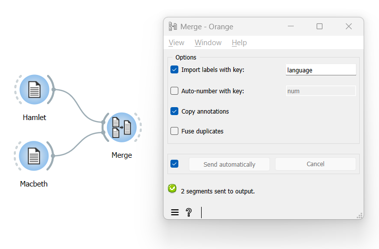

**Merge several texts**
=======================

**Goal**
--------

Merge several texts together so they can be further processed as a whole.

**Prerequisites**
-----------------

Two or more texts have been imported in Orange Textable (see :doc:`Cookbook: Text input <text_input>`) 
and possibly further processed (see :doc:`Cookbook: Segmentation manipulation <segmentation_manipulation>`).

**Ingredients**
---------------

  ==============  ==================  
   **Widget**      :doc:`Merge <widgets/merge>`   
   **Icon**        |merge_icon|    
   **Quantity**    1                 
  ==============  ==================  
  

**Procedure**
-------------

.. _merge_several_texts_fig1:

   Figure 1: Merge several texts with an instance of :doc:`Merge <widgets/merge>`

1. Create an instance of :doc:`Merge <widgets/merge>`.

2. Drag and drop from the output (righthand side) of the widgets that emit the segmentations to be merged together (here :doc:`Text Field <widgets/text_field>` (*Hamlet*) and :doc:`Text Field <widgets/text_field>` (*Macbeth*)), to the input of :doc:`Merge <widgets/merge>` (lefthand side).

3. Double-click on the icon of :doc:`Merge <widgets/merge>` to open its interface.

4. Click the **Send** button or tick the **Send automatically** checkbox.

5. A segmentation containing all input data merged together is then available at the output of :doc:`Merge <widgets/merge>`; to display or export it, see :doc:`Cookbook: Text output <text_output>`.

**See also**
------------

- :doc:`Getting started: Merging segmentations together`
- :doc:`Reference: Merge widget <widgets/merge>`
- :doc:`Cookbook: Text input <text_input>`
- :doc:`Cookbook: Segmentation manipulation <segmentation_manipulation>`
- :doc:`Cookbook: Text output <text_output>`