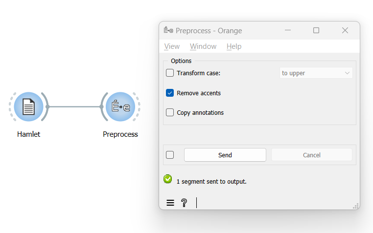

**Remove accents from text**
============================

**Goal**
--------

Remove all accents from text.

**Prerequisites**
-----------------

Some text has been imported in Orange Textable (see :doc:`Cookbook: Text input <text_input>`)
and possibly further processed (see :doc:`Cookbook: Segmentation manipulation <segmentation_manipulation>`).

**Ingredients**
---------------

  ==============  =======
   **Widget**      :doc:`Preprocess <widgets/preprocess>`
   **Icon**        |preprocess_icon|
   **Quantity**    1
  ==============  =======

**Procedure**
-------------

.. _remove_accents_from_text_fig1:

   Figure 1: Remove accents from text with an instance of :doc:`Preprocess <widgets/preprocess>`.

1. Create an instance of :doc:`Preprocess <widgets/preprocess>`.

2. Drag and drop from the output (righthand side) of the widget that
   emits the segmentation to be modified (here :doc:`Text Field <widgets/text_field>`
   (*Hamlet*)), to the input of :doc:`Preprocess <widgets/preprocess>`
   (lefthand side).

3. Double-click on the icon of :doc:`Preprocess <widgets/preprocess>`
   to open its interface.

4. In the **Processing** section, tick the **Remove accents** checkbox.

5. Click the **Send** button or tick the **Send automatically**
   checkbox.

6. A segmentation containing the modified text is then available at the
   output of :doc:`Preprocess <widgets/preprocess>`;
   to display or export it, see :doc:`Cookbook: Text output <text_output>`.

**See also**
------------

- :doc:`Reference: Preprocess widget <widgets/preprocess>`
- :doc:`Cookbook: Text input <text_input>`
- :doc:`Cookbook: Segmentation manipulation <segmentation_manipulation>`
- :doc:`Cookbook: Text output <text_output>`