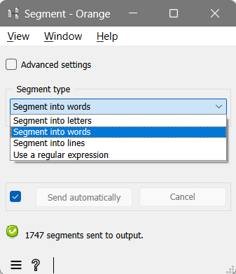
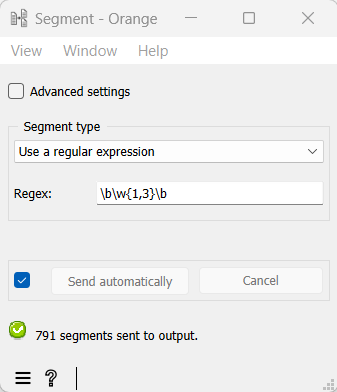
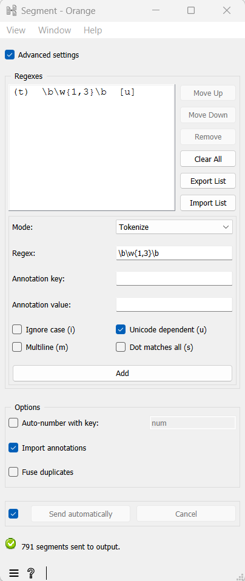

Segmenting with regexes
==============================

This tutorial has already shown how to use the :doc:`Segment <widgets/segment>`
widget to segment text into words, letters, or lines thanks to the
drop-down menu options.

.. _segmenting_with_regexes_fig1:

    Figure 1: Interface of the :doc:`Segment <widgets/segment>` widget, configured for word segmentation

As a matter of fact, these options in the interface of
:doc:`Segment <widgets/segment>`
rely on the use of regular expressions within the widget’s structure.
For instance, the regex ``\w+`` is used underlying the **Segment into
words** choice. It divides each incoming segment into sequences of
alphanumeric characters (and underscores)–which in our case amounts to
segmenting *a simple example* into three words. A similar operation is
launched with the ``\w`` regex to obtain a segmentation into letters (or to
be precise, alphanumeric characters or underscores).

With some knowledge about regular expressions, you can exploit the **Use
a regular expression** option in the drop-down menu to do more specific
queries. If the relevant unit is the word, regexes will often use the
``\b`` *anchor*, which represents a word boundary. For instance, words that
contain less than 4 characters can be retrieved with ``\b\w{1,3}\b``,
those ending in *-tion* with ``\b\w+tion\b``, and the inflected forms of
*retrieve* with ``\bretriev(e|es|ed|ing)\b``.

.. _segmenting_with_regexes_fig2:

    Figure 2: Using a Regular Expression (``\b\w{1,3}\b``) with the :doc:`Segment <widgets/segment>` widget

In these examples, the same result can be achieved by first using the
built-in **Segment into words** option and filtering the result with the
:doc:`Segment <widgets/segment>`
widget (see :doc:`Using a segmentation to filter another <using_segmentation_filter_another>`).
However, doing it in one step with
:doc:`Segment <widgets/segment>`
is more effective in terms of computation time. Besides, it makes it
possible to capture text fragments that are larger than words, e.g.
multi-word expressions.

To go further, you can add several regexes at the same time by ticking
the **Advanced settings** checkbox (see :ref:`figure 3 <segmenting_with_regexes_fig3>` below). Regexes can
then be used to describe the resulting tokens, as in the basic mode or,
depending on your research goal, to describe the delimiters occurring
between the resulting tokens (selecting mode **Split** instead of
**Tokenize**). For more information, see :doc:`Segment widget <widgets/segment>`.

.. _segmenting_with_regexes_fig3:

    Figure 3: Interface of the :doc:`Segment <widgets/segment>` widget with **Advanced settings** checked

In several other widgets (:doc:`Text Files <widgets/text_files>`,
:doc:`URLs <widgets/urls>`,
and :doc:`Recode <widgets/recode>`),
**Advanced settings** also allows you to switch from a single
manipulation to a series of operations. In most widgets, they give
access to additional useful options.