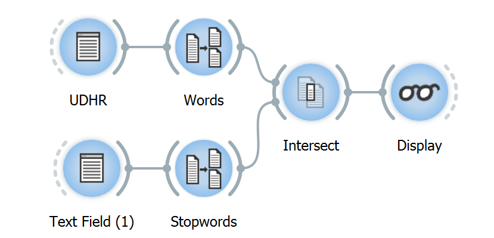

**5. Using a segmentation to filter another**
=============================================

There are many situations where we might want to select or exclude
segments from a segmentation. A typical example is the removal of
“stopwords” (i.e. determiners, pronouns, prepositions, etc.) from a
text, in order to restrict analyses to content words (cf. `an example of
a list of
stopwords <http://members.unine.ch/jacques.savoy/clef/englishST.txt>`__).

The purpose of widget :doc:`Intersect <widgets/intersect>`
is precisely to solve that kind of problem. It takes two segmentations
in input and lets the user include in or exclude from the first
(*source*) segmentation those segments whose content is the same as that
of a segment in the second (*filter*) segmentation. The widget’s basic
interface is shown on :ref:`figure 1 <using_segmentation_filter_another_fig1>`
below.

.. _using_segmentation_filter_another_fig1:

.. figure:: figures/intersect_example.png
    :align: center
    :alt: Interface of widget Intersect configured for stopword removal

    Figure 1: Interface of widget :doc:`Intersect <widgets/intersect>` configured for stopword removal.

The **Mode** option serves to indicate if the segments present in the
filter segmentation should be removed from the source segmentation
(**Exclude**) or, conversely, if they should be retained (**include**);
in the latter case, all the segments *absent* in the filter segmentation
will be removed from the source segmentation. The next step is to
specify which incoming segmentation plays the role of the **Source**
segmentation and the **Filter** segmentation.

In order to try out the widget, set up a workflow similar to the one
shown on :ref:`figure 2 <using_segmentation_filter_another_fig2>`
below. The first instance of :doc:`Text Field <widgets/text_field>`
(*UDHR*) contains the text to process (for instance the `Universal
Declaration of Human Rights <http://www.un.org/en/documents/udhr/>`__),
while :doc:`Text Field <widgets/text_field>`
(*Stopwords*), contains the list of English stopwords mentioned above.
Both instances of
:doc:`Segment <widgets/segment>`
produce a word segmentation (**Segment into words**); the only
difference in their configuration is the widget label , i.e. *Words*
versus *Stopwords*. Finally,
:doc:`Intersect <widgets/intersect>`
is configured as shown on :ref:`figure 1 <using_segmentation_filter_another_fig1>`
above.

.. _using_segmentation_filter_another_fig2:

Figure 2: Example workflow for removing stopwords using widget
:doc:`Intersect <widgets/intersect>`.

The content of the first segments of the resulting segmentation is:

PREAMBLE

Whereas

recognition

inherent

dignity

equal

inalienable

rights

members

human

family

foundation

freedom

justice

peace

world

...

**5.1. See also**
-----------------

.. toctree::
    :maxdepth: 1

    Reference: Intersect widget <widgets/intersect>
    Cookbook: Exclude segments based on a stoplist <exclude_segments_based_on_stoplist>
